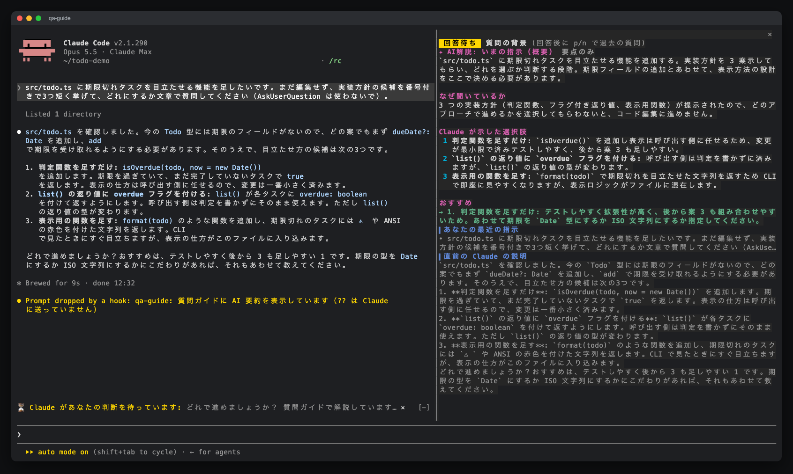

# claude_qamods

日本語 · [English](README.md)

Claude の質問を読みやすく、答えやすくする Claude Code の mod 集です。

最初の mod **qa-guide** は、Claude が `AskUserQuestion` で質問するたびに横にペインを開きます。ペインには、Claude が**なぜ**聞いているのか、**それぞれの選択肢を選ぶと何が起きるのか**が表示されます。会話をさかのぼって確認しなくても、そのまま答えられます。


[](docs/media/qa-guide-pv-16x9.mp4)

▶ デモ動画: [横長 16:9](docs/media/qa-guide-pv-16x9.mp4) · [縦長 9:16](docs/media/qa-guide-pv-9x16.mp4)

## 目次

- [作った理由](#作った理由)
- [機能](#機能)
- [動作要件](#動作要件)
- [インストール](#インストール)
- [使い方](#使い方)
- [文章での質問](#文章での質問)
- [仕組み](#仕組み)
- [プライバシーとコスト](#プライバシーとコスト)
- [困ったとき](#困ったとき)
- [開発](#開発)
- [コントリビュート](#コントリビュート)
- [クレジット](#クレジット)
- [ライセンス](#ライセンス)

## 作った理由

Claude の質問ダイアログに表示されるのは、質問文と短い選択肢だけです。セッションが長くなると、何についての質問なのかが分からなくなりがちで、答える前に会話をさかのぼって確認することになります。qa-guide は、その確認に必要な情報をダイアログの横に表示します。

## 機能

**質問に答えている間**（コンパクト表示。スクロールなしでペインに収まります）

- **AI 解説**（標準ではセッションの要点をもとに裏で生成します）
  - いま Claude が従っている指示の概要
  - なぜ今この質問をしているのか
  - 選択肢ごとの影響（ダイアログと同じ番号で並びます）
  - おすすめの選択肢（1 行）
- **あなたの最近の指示**: あなたが入力したプロンプトだけを表示します。タスクの通知などのシステムメッセージは除きます。
- **直前の Claude の説明**（末尾）
- **全文脈で解説**ボタンで、会話全体を使って解説を生成し直せます。ペインに余裕がある場合に表示され、AI 見出しには「要点のみ」か「全文脈」が付きます。
- 質問文と選択肢は、ダイアログに出ているので重ねて表示しません。

**回答したあと**（全文表示）

- 説明とプレビューつきの選択肢カード。選んだ答えには緑の ✔ が付きます
- 自由記述の回答と複数選択の回答にも対応します（カンマを含むラベルも正しく扱います）
- 直近 20 件の質問の履歴。`p` / `n` / `l` で 1 件ずつ移動するか、一覧から開きます

| 回答後の全文表示 | `p` / `n` で履歴をさかのぼる |
| --- | --- |
|  |  |

**文章での質問**

- Claude が返答の末尾に文章で書いた質問を検出し、プロンプトの上から解説を依頼できます。検出にトークンは使わず、解説を依頼したときだけ生成します。詳しくは[文章での質問](#文章での質問)を見てください。

## 動作要件

- **Claude Code 2.1.286 以降**。function hooks のプラグイン API を使っています。この API は **early access** で、リリースごとに変わる可能性があります。
- ターミナル（フルスクリーンモード推奨）。幅が **144 列以上**あるとペインが自動で開きます。それより狭い場合も、`/qa-guide` で開けます。
- ペインの表示と AI 解説は**日本語と英語**に対応しています。標準では自動で選びます。詳しくは[使い方](#使い方)を見てください。

## インストール

Claude Code の中で次の 2 つを実行します。

```text
/plugin marketplace add aieo-product/claude_qamods
/plugin install qa-guide@claude-qamods
```


インストール時に未設定の `userConfig` オプションがあると表示されることがありますが、対応は不要です。既定値は `language` が `auto`、`context` が `compact`、`showCost` が `on`、`chatQuestions` が `on` です。変更する場合は、`/plugin configure qa-guide@claude-qamods` か `/config` で設定してください。

更新は `/plugin marketplace update claude-qamods` のあとに `/plugin update qa-guide@claude-qamods`、アンインストールは `/plugin uninstall qa-guide@claude-qamods` です。

## 使い方

Claude が質問すると、ダイアログの横にペインが開きます。回答はいつもどおりダイアログで行います。

言語設定の初期値は `auto` です。質問文または選択肢のラベルにひらがな・カタカナが含まれていれば日本語、それ以外は英語でペインと AI 解説を表示します。中国語だけの文も英語になります。履歴は作成時に選んだ言語を保持し、旧バージョンで保存した履歴は日本語で表示します。


言語を固定するには、`/config` で qa-guide の `language` を `en`（英語）または `ja`（日本語）に設定します。`auto` に戻すと自動選択になります。質問がまだない場合の自動選択は、Claude Code の言語設定があればそれを優先します（日本語なら日本語、それ以外の言語なら英語）。次にロケール（`LC_ALL`、空なら `LANG`）を参照し、`ja` で始まれば日本語、それ以外は英語を使います。

`context` の既定値は `compact` です。要点をまとめた長さ制限付きのプロンプトを Haiku に送り、セッションが長くなっても解説の入力は増えません。ダイアログの解説で毎回会話全体を使いたい場合は、`/config` で `context` を `full` に設定します。質問 1 件だけ生成し直すには、**全文脈で解説**を選びます。その質問の解説が、会話全体を使った新しい解説に置き換わります。クリック対応の画面ではボタンをクリックでき、回答後はペインにフォーカスして `f` を押せます。

Claude Desktop アプリでは、質問ダイアログが開いている間も**全文脈で解説**ボタンをクリックできます。

`showCost` は `on` / `off` の選択式で、既定値は `on` です。`/config` または `/plugin configure qa-guide@claude-qamods` で `off` にすると、API 料金の換算額を隠して実測トークン数だけを表示します。

| 操作 | 場所 | 動作 |
| --- | --- | --- |
| `/qa-guide` | プロンプト | ガイドを開く（最初の質問の前でも開けます） |
| `p` / `n` | ペインにフォーカス中 | 前の（古い）質問 / 次の（新しい）質問 |
| `l` | ペインにフォーカス中 | 最新の質問に戻る |
| `h` | ペインにフォーカス中 | 履歴一覧の表示を切り替える |
| `a` | ペインにフォーカス中 | 次の質問からの AI 解説を ON / OFF する |
| `f` / **全文脈で解説** | ペインにフォーカス中 / ボタン | 選択中の質問を会話全体で解説し直す |
| `Ctrl+X` → `Tab`、またはクリック | どこでも | キーボードのフォーカスをペインに移す |
| `Esc` | ペインにフォーカス中 | フォーカスをプロンプトに戻す |

質問ダイアログが出ている間はダイアログがキーボードを握るので、ペインはスクロールできません。そのため、回答中はスクロールなしで収まるコンパクト表示にしています。回答したあとの全文表示はスクロールできます。

## 文章での質問

Claude が返答の末尾に、ダイアログではなく文章で質問を書くことがあります。qa-guide は **0 トークン**のローカルな判定でこれを検出し、プロンプトの上に質問文と **AI要約**ボタンを含む帯を表示できます。v0.5.1 から既定で有効です。無効にするには、`/config` → **qa-guide** → **Plain-text questions** → `off`（`chatQuestions`）を選びます。



次の 3 通りの方法で解説を依頼できます。

- **AI要約**をクリックする。
- `??` と入力して Enter を押す。質問が保留中なら qa-guide が手元で処理し、`??` は Claude に送りません。
- `Ctrl+X` → `Tab` で帯にフォーカスを移し、`e` を押す。

解説は質問ガイドペインに**文章での質問**として表示されます。次のプロンプトがその質問への回答として記録され、帯が消えます。解説を依頼せずに回答した場合は、帯だけが消えて履歴は作りません。**×**をクリックすると質問を閉じられます。

解説を依頼するまでは、検出と帯の表示に使うトークンは **0** です。依頼すると、ダイアログの要点のみの解説と同じく、要点をまとめた Haiku のリクエストを 1 回送ります（実測で 1 回あたり約 $0.001〜0.004、API 料金換算）。`context` が `full` でも最初は要点のみで生成し、あとから**全文脈で解説**で会話全体を使って生成し直せます。判定はヒューリスティックなので、質問を見逃したり、質問ではない行を誤検出したりすることがあります。

## 仕組み

qa-guide は 1 つの hooks module（`plugins/qa-guide/hooks/register.tsx`）でできています。

| フック | 役割 |
| --- | --- |
| `prompt.submit` | あなたが入力した直近 5 件のプロンプトを記録する（origin が `composer`・`bridge`・`sdk` のもの）。保留中の文章での質問への `??` と回答も処理する |
| `tool.call`（`AskUserQuestion`） | 文脈を集めてペインを開き、AI 解説の生成を回答を待たせない形で始め、ダイアログの回答を待って保存する |
| `turn.complete` | `chatQuestions` が `off` でなければ、モデルを呼ばずに Claude の返答末尾の文章での質問を検出する |
| `ui.render`（`AbovePrompt`） | 文章での質問が有効で、回答待ちの質問があるときに帯を表示する |
| `ui.render`（`Pane`） | 質問中はコンパクト表示、回答後は全文表示を描く |
| `session.start` / `command.run` | `/qa-guide` を登録して処理する |

標準の AI 解説は `$.model.complete` で `model: 'haiku'` を使い、出力を最大 1,500 トークンに制限します。要点のみのプロンプトには、qa-guide の指示文・あなたの最近の指示 3 件（各 600 文字まで）・直前の Claude の説明（末尾 2,500 文字まで）・最後の実ユーザープロンプト以降のツール操作の概要（直近 12 件、各ツール名と入力の最初の文字列フィールドを合わせて 120 文字まで）・質問を含めます。会話全体の長さに関係なく、プロンプト全体を 12,000 文字以内に収めます。

ダイアログの質問で `context: full` を使う場合と、どちらの種類の質問でも**全文脈で解説**を選んだ場合は、`$.model.fork` を使い、セッションの既存の会話に対して同じモデルでツールなしの質問を 1 回だけ投げます。セッションの最初の応答より前に Claude が質問した場合は、まだ fork できる会話がないので、短い `haiku` の completion に切り替えます。解説は読んでいる間に届き、ダイアログを待たせることはありません。新しい解説で選択中の履歴の解説を置き換え、古い生成処理の結果が後から届いても反映しません。状態は `$.state` に持つので、ホットリロードでは消えず、セッションが終わると消えます。

## プライバシーとコスト

- **Claude Code 経由で送ります。** qa-guide が独自に通信することはありません。AI 解説は、セッションがすでに使っているアカウントで送ります。標準では上記の長さ制限付きの要点プロンプトだけを Haiku に送ります。**全文脈で解説**や、ダイアログの質問での `context: full` では、会話全体をセッションのモデルに fork で送り、まだ fork できる会話がなければ短い Haiku の completion に切り替えます。
- **ディスクには何も書きません。** プロンプト・質問・回答はセッションのメモリ（`$.state`）にだけ置き、セッションが終わると消えます。
- **コスト。** AI 解説が ON の場合、ダイアログの質問 1 件ごとにモデル呼び出しが 1 回増えます。文章での質問では、解説を依頼したときだけ要点をまとめた Haiku の呼び出しが 1 回増えます。**全文脈で解説**を使うたびに、さらに 1 回増えます。ダイアログの自動の AI 解説は `a` で OFF にできます。ペインや質問の帯を表示するだけではモデルを呼びません。

### 質問 1 回あたりのトークン消費


| | 送るもの | トークン数の目安 |
| --- | --- | --- |
| **ペインの表示（AI なし）** | なし。最近の指示と直前の説明は、手元のセッションから読みます。 | 0 |
| **AI 解説（要点のみ、標準）** | 指示文・最近の指示 3 件（各 600 文字）・直前の Claude の説明（末尾 2,500 文字）・ツール操作の概要 12 件（各 120 文字）・質問。プロンプト全体は最大 12,000 文字で、会話全体は送りません。 | 入力: 通常は約 1,500〜4,000。セッションの長さに依存しません（言語や内容によりトークン数は変わります）<br>出力: 最大 1,500 |
| **AI 解説（全文脈）** | セッションの会話全体を fork し、qa-guide の指示文・最近の指示 3 件（各 600 文字まで）・質問を足して送ります。ダイアログの質問での `context: full` と**全文脈で解説**ボタンで使います。 | 会話全体: プロンプトキャッシュから読み込み（セッションの会話の長さ分）<br>追加の入力: 約 1,000〜3,000<br>出力: 約 500〜1,000（モデルが考える分、増えることがあります） |
| **全文脈のフォールバック** | まだ fork できる会話がない場合だけ。最近の指示・直前の Claude の説明・質問を含む短いプロンプトを送ります。 | 入力: 通常は約 1,500〜4,000<br>出力: 最大 1,500 |

- **実測値。** 解説の生成後に、入力・キャッシュ読み込み・キャッシュ書き込み・出力の実測トークン数を、使ったモデルを示す `haiku` または `session` とともに表示します。コンパクト表示では、行に余裕があるときだけ表示します。**全文脈で解説**を再実行すると、その履歴の使用量を新しい結果で置き換えます。
- **API 料金の換算額。** 既定では、使用量の行の末尾に `≈ $0.0052（API料金換算）` のような概算を表示します。実測トークン数に、**2026-09 時点の USD 建て API 定価**を組み込んだ料金表を掛けて計算します。キャッシュ読み込みと書き込み（入力単価の 1.25 倍）も含みます。価格が変わった場合は、この料金表の更新が必要です。未知のモデルはトークン数だけを表示します。
- **セッション合計。** 全文表示のツールバーには、セッション内で qa-guide が呼び出したモデルの 4 項目をすべて足したトークン数と、その横に API 料金の換算額を表示します。再実行や、新しい生成処理に置き換えられた古い処理の完了分も含みます。金額は価格が分かる呼び出しだけを合計し、`≈ $0.031+` のような `+` は換算できない使用量があることを示します。合計はホットリロード後も残り、セッションが終わると消えます。
- **使うモデル。** 要点のみの解説と全文脈のフォールバックは `haiku` という別名を使い、料金は `claude-haiku-4-5` として計算します。全文脈の fork はセッションのモデルで動き、リクエスト開始時にそのモデル ID を取得するので、`/model` で切り替えるとそれに合わせて変わります。全文脈から Haiku にフォールバックした場合は、fork とフォールバックの使用量をそれぞれのモデルの単価で計算して合計します。
- **全文脈でキャッシュが効かない場合。** fork で送る会話の先頭部分は、直前のメインのリクエストとまったく同じなので、通常はプロンプトキャッシュから読まれます。キャッシュの期限が切れていたり、`/model` で切り替えた直後だったりすると、会話全体が 1 回分、通常の入力として処理されます。要点のみでは会話全体を fork しません。
- **プラン。** Pro / Max プランで使っている場合、これらのトークンはトークン単位の課金ではなく、プランの利用枠として消費されます。表示金額は API 定価との比較用の概算で、サブスクリプションの請求額ではありません。

## 困ったとき

| 症状 | 対処 |
| --- | --- |
| Claude が質問してもペインが開かない | ターミナルの幅が 144 列未満です。幅を広げるか、`/qa-guide` を実行してください。この場合はトーストで知らせます。 |
| `/qa-guide` が認識されない | `/plugin` で `qa-guide@claude-qamods` がインストール済みで有効になっているかを確認し、新しいセッションを始めてください。 |
| AI 解説が「生成できませんでした」になる | モデルへのリクエストが失敗したか、空の応答が返りました（API エラーやレート制限など）。ペインのほかの部分は使えます。次の質問では再度生成を試みます。 |
| Claude Code を更新したら何も表示されない | early access の API が変わった可能性があります。Claude Code のバージョンを添えて [issue を作成](https://github.com/aieo-product/claude_qamods/issues/new/choose)してください。 |

## 開発

```sh
git clone https://github.com/aieo-product/claude_qamods
cd claude_qamods
claude --plugin-dir plugins/qa-guide        # セッションで試す
```

チェック:

```sh
claude plugin validate .                    # マーケットプレイスの manifest
claude plugin validate plugins/qa-guide     # プラグインの manifest と hooks module
claude plugin test plugins/qa-guide         # terminal / desktop の 2 サーフェスでテスト
npx -y -p typescript@5 tsc -p plugins/qa-guide --noEmit
```

型チェックには、engine が書き出す型定義（`plugins/qa-guide/.claude-plugin/types/`）が必要です。このファイルは gitignore 済みで、手元のチェックアウトからプラグインを初めて読み込んだときに Claude Code が書き出します。開発の流れは [CONTRIBUTING.md](CONTRIBUTING.md) を見てください。

## コントリビュート

issue や pull request を歓迎します。[CONTRIBUTING.md](CONTRIBUTING.md) と[行動規範](CODE_OF_CONDUCT.md)を読んでください。セキュリティ上の問題は [SECURITY.md](SECURITY.md) の手順で報告してください。

## クレジット

- デモ動画のナレーション: Irodori-TTS v4-Large（Gemma Terms of Use）
- デモ動画の音楽と効果音: このプロジェクトのために合成したオリジナル
- スクリーンショットとデモ動画は、使い捨てのデモ用プロジェクトで撮影しています

## ライセンス

[MIT](LICENSE) © aieo-product
