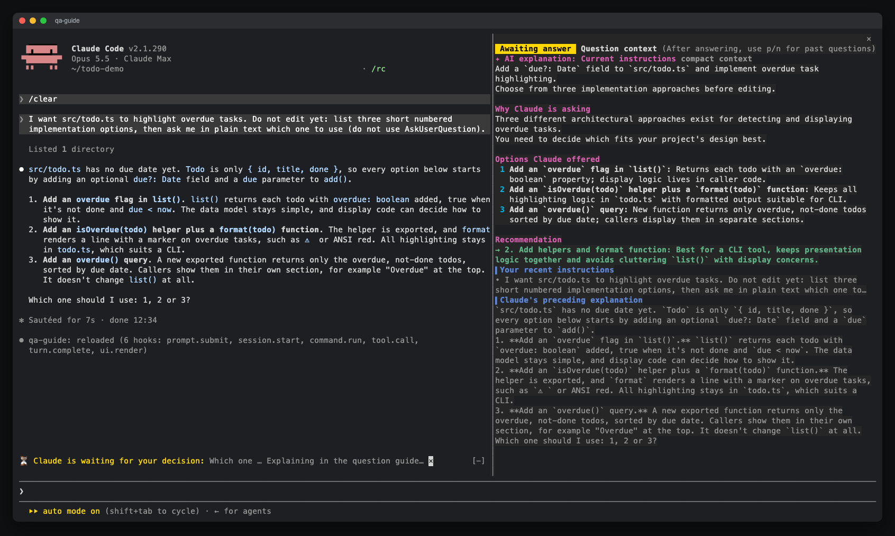

# claude_qamods

[日本語](README.ja.md) · English

Claude Code mods that make Claude's questions easier to read and answer.

The first mod, **qa-guide**, opens a side pane whenever Claude asks you something with `AskUserQuestion`. The pane explains *why* Claude is asking and *what each option leads to*, so you can answer without scrolling back through the conversation.


[](docs/media/qa-guide-pv-16x9.mp4)

▶ Demo video: [landscape 16:9](docs/media/qa-guide-pv-16x9.mp4) · [portrait 9:16](docs/media/qa-guide-pv-9x16.mp4)

## Contents

- [Why](#why)
- [Features](#features)
- [Requirements](#requirements)
- [Install](#install)
- [Usage](#usage)
- [Plain-text questions](#plain-text-questions)
- [How it works](#how-it-works)
- [Privacy and cost](#privacy-and-cost)
- [Troubleshooting](#troubleshooting)
- [Development](#development)
- [Contributing](#contributing)
- [Credits](#credits)
- [License](#license)

## Why

Claude's question dialog shows a question and a few short options. After a long session it is easy to lose track of what the question is about, so you end up scrolling back through the transcript before you can answer. qa-guide keeps that context next to the dialog.

## Features

**While a question is open** (compact view, fits the pane without scrolling)

- **AI explanation**, generated in the background from a compact summary of the session by default:
  - a summary of the instructions Claude is currently working under
  - why Claude is asking now
  - the effect of each option, numbered exactly like the dialog
  - a one-line recommendation
- **Your recent instructions.** Only prompts you typed are shown. Task notifications and other engine messages are left out.
- **The tail of Claude's explanation** leading up to the question.
- A **Full context** button to regenerate the explanation using the whole session. It appears when the pane has room; the AI heading shows `compact context` or `full context`.
- The question text and options are not repeated. They are already in the dialog.

**After you answer** (full view)

- Option cards with descriptions and previews, with a green ✔ on what you chose
- Free-text answers and multi-select answers, including labels that contain commas
- History of the last 20 questions: step through them with `p` / `n` / `l`, or open one from the list

| Full view after answering | Browsing history with `p` / `n` |
| --- | --- |
|  |  |

**Plain-text questions**

- Detect questions Claude writes at the end of a reply and offer an explanation above the prompt. Detection costs no tokens; an explanation runs only when you request it. See [Plain-text questions](#plain-text-questions).

## Requirements

- **Claude Code 2.1.286 or later.** The mod uses the function-hooks plugin API, which is **early access** and may change between releases.
- A terminal, preferably in fullscreen mode. The pane opens on its own when the terminal is at least **144 columns** wide. `/qa-guide` opens it at any width.
- The pane labels and AI explanations support **English and Japanese**. Language selection is automatic by default; see [Usage](#usage).

## Install

Run these commands inside Claude Code:

```text
/plugin marketplace add aieo-product/claude_qamods
/plugin install qa-guide@claude-qamods
```

The installer may report unset `userConfig` options. You can ignore this: `language` defaults to `auto`, `context` to `compact`, `showCost` to `on`, and `chatQuestions` to `on`. To change an option, run `/plugin configure qa-guide@claude-qamods` or use `/config`.

To update, run `/plugin marketplace update claude-qamods` and then `/plugin update qa-guide@claude-qamods`. To remove it, run `/plugin uninstall qa-guide@claude-qamods`.

## Usage

When Claude asks a question, the pane opens next to the dialog. Answer in the dialog as usual.

The default language option is `auto`. A question or option label containing hiragana or katakana selects Japanese; otherwise, the pane and AI explanation use English. Chinese text alone selects English. Each history entry keeps the language chosen when it was created; entries saved by older versions stay Japanese.


Run `/config` and set qa-guide's `language` option to `en` or `ja` to choose a fixed language, or `auto` to restore automatic selection. Before any question exists, automatic selection uses Claude Code's language setting when available (Japanese selects Japanese; other languages select English), then the locale (`LC_ALL`, or `LANG` when `LC_ALL` is empty). A locale starting with `ja` selects Japanese; otherwise, the fallback is English.


The `context` option defaults to `compact`: explanations use a bounded summary and Haiku, so their input does not grow with the session. Set `context` to `full` in `/config` to use the whole session for every new dialog explanation. For one question, choose **Full context** to replace its explanation with a new one using the whole session. The button can be clicked on surfaces that support clicks. After answering, focus the pane and press `f`.

In the Claude Desktop app, the **Full context** button can be clicked while the question dialog is still open.

The `showCost` option is an `on` / `off` picker and defaults to `on`. Set it to `off` in `/config` or `/plugin configure qa-guide@claude-qamods` to show measured tokens without the API-price estimate.

| Control | Where | Action |
| --- | --- | --- |
| `/qa-guide` | prompt | Open the guide (also before the first question) |
| `p` / `n` | pane focused | Previous (older) / next (newer) question |
| `l` | pane focused | Back to the latest question |
| `h` | pane focused | Show or hide the history list |
| `a` | pane focused | Turn AI explanations on or off for the next questions |
| `f` / **Full context** | pane focused / button | Regenerate the selected question's explanation using the whole session |
| `Ctrl+X` then `Tab`, or click | anywhere | Move keyboard focus into the pane |
| `Esc` | pane focused | Return focus to the prompt |

While the question dialog is open it holds the keyboard, so the pane cannot be scrolled. That is why the compact view is sized to fit. After you answer, the full view can be scrolled.

## Plain-text questions

Claude sometimes ends a turn with a question written in plain text. qa-guide can detect these questions with a local heuristic that uses **0 tokens**, and show a band above the prompt with the question and an **Explain** button. The feature is on by default (since v0.5.1). To turn it off, run `/config` → **qa-guide** → **Plain-text questions** → `off` (`chatQuestions`).



Request an explanation in any of these three ways:

- Click **Explain**.
- Type `??` and press Enter. When a question is pending, qa-guide handles `??` locally; it is never sent to Claude.
- Press `Ctrl+X` → `Tab` to focus the band, then `e`.

The explanation appears in the question guide pane as an **In-text question** entry. Your next prompt is recorded as its answer and clears the band. If you answer without requesting an explanation, the band clears and no history entry is created. Click **×** to dismiss the question.

Detection and the band cost **0 tokens** until you request an explanation. That request uses one compact Haiku call (measured at about $0.001–0.004 at API prices), just like compact explanations for dialog questions, even when `context` is set to `full`. You can choose **Full context** afterwards to regenerate it using the whole session. Detection is a heuristic: it may miss a question or mistake another line for one.

## How it works

qa-guide is a single hooks module, `plugins/qa-guide/hooks/register.tsx`:

| Hook | What it does |
| --- | --- |
| `prompt.submit` | Records the last 5 prompts you typed (origins `composer`, `bridge`, `sdk`), handles `??` for pending plain-text questions, and records their answers |
| `tool.call` (`AskUserQuestion`) | Collects context, opens the pane, starts the AI explanation without blocking, then waits for the dialog and stores the answer |
| `turn.complete` | Unless `chatQuestions` is `off`, checks the end of Claude's reply for a plain-text question without calling a model |
| `ui.render` (`AbovePrompt`) | Shows the question band when an opted-in plain-text question is waiting for an answer |
| `ui.render` (`Pane`) | Draws the compact view while the question is open and the full view afterwards |
| `session.start` / `command.run` | Registers and handles `/qa-guide` |

By default, the AI explanation uses `$.model.complete` with `model: 'haiku'` and an output limit of 1,500 tokens. Its compact prompt contains qa-guide's instructions, your last 3 prompts (up to 600 characters each), the tail of Claude's lead-up text (up to 2,500 characters), a summary of tool activity since your last real prompt (the last 12 tool uses, each tool name and first string input clipped to 120 characters), and the questions. The entire prompt is capped at 12,000 characters, regardless of transcript size.

With `context: full` for dialog questions or **Full context** for either kind of question, qa-guide uses `$.model.fork` to ask one tool-less question over the session's existing transcript on the session's model. If Claude asks before the session has produced its first response, there is no transcript to fork yet, so this path falls back to a short `haiku` completion. The explanation arrives while you are still reading, and the dialog is never held back. A newer explanation replaces the selected entry's previous explanation; late results from an older run are ignored. State lives in `$.state`, so it survives a hot reload but not the end of the session.

## Privacy and cost

- **Requests go through Claude Code.** qa-guide sends no network requests of its own. AI explanations use the account the session already uses. The default sends Haiku only the bounded compact prompt described above. Choosing **Full context** or setting `context: full` for dialog questions sends the whole session transcript to the session's model through a fork; if no transcript exists yet, it falls back to a short Haiku completion.
- **Nothing is written to disk.** Prompts, questions and answers are kept in session memory (`$.state`) and are gone when the session ends.
- **Cost.** Each dialog question with AI explanations on adds one model call. Plain-text questions add one compact Haiku call only when you request an explanation. Each **Full context** request adds another call. Press `a` to turn automatic dialog explanations off; rendering the pane or question band alone never calls a model.

### Token usage per question


| | What is sent | Approximate tokens |
| --- | --- | --- |
| **Pane (no AI)** | Nothing. Your recent prompts and Claude's lead-up text are read from the local session. | 0 |
| **AI explanation (compact, default)** | Instructions, last 3 prompts (600 characters each), Claude's lead-up text (last 2,500 characters), last 12 tool summaries (120 characters each), and questions. The whole prompt is capped at 12,000 characters; the full transcript is not sent. | Input: typically ~1,500–4,000, independent of session length (tokens vary by language and content).<br>Output: up to 1,500. |
| **AI explanation (full context)** | A fork of the whole session transcript, plus qa-guide's instructions, your last 3 prompts (up to 600 characters each) and the question. Used by `context: full` for dialog questions and the **Full context** button. | Transcript: read from the prompt cache (as many tokens as the session holds).<br>Added input: ~1,000–3,000.<br>Output: ~500–1,000, more if the model thinks. |
| **Full-context fallback** | Only when there is no transcript to fork yet: a short prompt with the recent instructions, Claude's lead-up text and the questions. | Input: typically ~1,500–4,000.<br>Output: up to 1,500. |

- **Measured usage.** Each completed explanation shows its measured input, cache-read, cache-write and output tokens, labelled `haiku` or `session` for the model used. The compact view shows this line when a row is available. A **Full context** re-run replaces that entry's usage with the new result.
- **API-price estimate.** By default, the usage line ends with an estimate such as `≈ $0.0052 (API price)`. It multiplies measured tokens by a built-in table of USD list prices as of **2026-09**, including cache reads and cache writes (1.25 × the input rate). This table must be updated when prices change. Unknown models show tokens only.
- **Session total.** The full-view toolbar shows the total of all four token fields across qa-guide's model calls in the session, including re-runs and completed calls whose results were superseded, with the API-price estimate beside it. The cost sums only priced calls; `+`, as in `≈ $0.031+`, means some usage could not be priced. These totals survive a hot reload and reset when the session ends.
- **Which model.** Compact explanations and the full-context fallback use the `haiku` alias, priced as `claude-haiku-4-5`. Full-context forks run on the session's model, whose ID is read when the request starts, so switching with `/model` changes them too. If a full-context run falls back to Haiku, the fork and fallback usage are priced separately and added together.
- **Cache misses in full context.** The fork's transcript prefix is identical to the session's last request, so it is normally served from the prompt cache. If the cache has expired, or right after `/model`, the whole transcript is processed as fresh input once. Compact mode never forks the transcript.
- **Plans.** With a Pro or Max subscription these tokens count against your usage limits rather than being billed per token. The API-price estimate is a comparison with API list prices, not a subscription charge.

## Troubleshooting

| Symptom | Fix |
| --- | --- |
| The pane does not open when Claude asks | The terminal is narrower than 144 columns. Widen it, or run `/qa-guide`. A toast tells you when this happens. |
| `/qa-guide` is not recognised | Run `/plugin` and check that `qa-guide@claude-qamods` is installed and enabled, then start a new session. |
| AI explanation says it could not be generated | The model request failed or returned no text (for example an API error or rate limit). The rest of the pane still works, and the next question tries again. |
| Nothing renders after a Claude Code update | The early-access API may have changed. Please [open an issue](https://github.com/aieo-product/claude_qamods/issues/new/choose) with your Claude Code version. |

## Development

```sh
git clone https://github.com/aieo-product/claude_qamods
cd claude_qamods
claude --plugin-dir plugins/qa-guide        # try it in a session
```

Checks:

```sh
claude plugin validate .                    # marketplace manifest
claude plugin validate plugins/qa-guide     # plugin manifest and hooks module
claude plugin test plugins/qa-guide         # tests on terminal and desktop surfaces
npx -y -p typescript@5 tsc -p plugins/qa-guide --noEmit
```

Type checking needs the engine-written declarations in `plugins/qa-guide/.claude-plugin/types/`. They are gitignored, and Claude Code writes them the first time it loads the plugin from your checkout. See [CONTRIBUTING.md](CONTRIBUTING.md) for the full workflow.

## Contributing

Issues and pull requests are welcome. Please read [CONTRIBUTING.md](CONTRIBUTING.md) and the [Code of Conduct](CODE_OF_CONDUCT.md). To report a security issue, follow [SECURITY.md](SECURITY.md).

## Credits

- Demo video narration: Irodori-TTS v4-Large (Gemma Terms of Use)
- Demo video music and sound effects: original, synthesized for this project
- Screenshots and the demo video were captured in a throwaway demo project

## License

[MIT](LICENSE) © aieo-product
